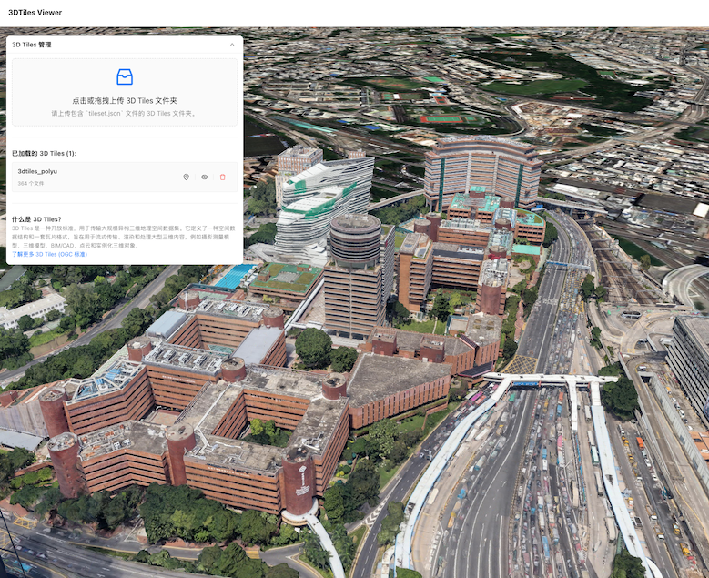

# 3DTilesViewer

This is a simple **web application** built with React and Cesium, allowing users to upload and visualize local 3D Tiles data directly in their browser.

Link: [3DTilesViewer](https://ni1o1.github.io/3DTilesViewer/)

---

## 🚀 Features

* **Local 3D Tiles Upload**: Users can drag and drop or click to select a local 3D Tiles folder. The application automatically parses and loads the `tileset.json` file and its associated resources.
* **Multi-language Support**: The user interface supports both Chinese and English, automatically switching based on the browser's language settings.
* **Tileset Management**:
    * **Fly To**: Quickly navigate the camera to the extent of a loaded 3D Tileset.
    * **Show/Hide**: Individually control the visibility of each loaded tileset.
    * **Remove**: Delete unwanted tilesets from the scene and release associated resources.
* **3D Tiles Information**: Provides a toggleable section explaining what 3D Tiles are, including a link to the official OGC standard.
* **Error Handling**: Offers clear error messages during the upload and loading processes.

---

## 🛠️ Tech Stack

* **React**: A JavaScript library for building user interfaces.
* **CesiumJS**: A powerful open-source geospatial visualization library for rendering a 3D globe and tilesets.
* **Ant Design**: A high-quality React UI component library used for building a clean and responsive user interface (e.g., floating panel, buttons, lists).
